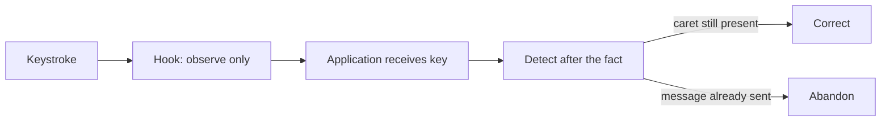
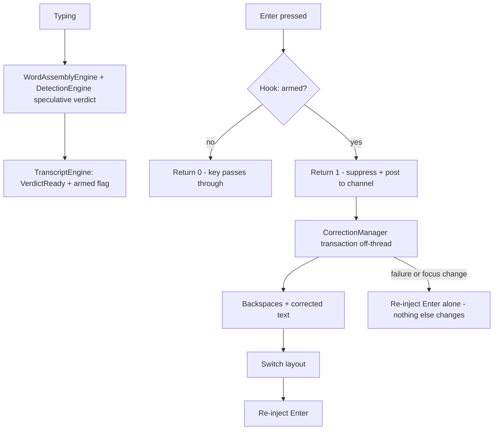
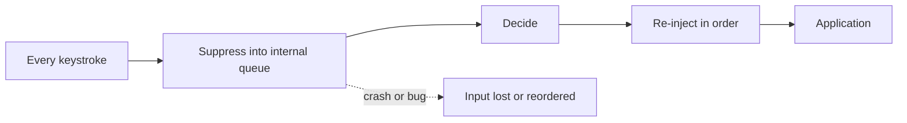

# Design Analysis — Feature 001-layout-autocorrect / Iteration 001

**Feature**: 001-layout-autocorrect
**Iteration**: 001
**Date**: 2026-08-19
**Spec**: file:///C:/Dev/KeyContextAI/specs/001-layout-autocorrect/spec.md

## Problem Framing

KeyContext AI observes every keystroke, decides whether a word was typed on the wrong keyboard layout,
and replaces it in place while switching the layout — without perceptibly delaying typing and without
ever persisting or transmitting what the user typed. The intake workshop already bound the system's
shape: strict IDesign call rules, a single tray-app process, a managed low-level hook that is
native-swap-ready, a Channels pipeline with a serialized correction executor, .NET 10 with WPF, and
Microsoft Agent Framework 1.0 behind an accessor contract for the AI tier.

Two decisions were left open for this iteration, and the first was created by the clarify answer.
FR-005b requires that on a committing key such as Enter, the correction is attempted **before the key
reaches the application** — otherwise the last word of every chat message ships uncorrected, which is
the most visible instance of the problem this product exists to solve. Meeting that requirement means
the hook must sometimes suppress a keystroke and re-inject it, and a `WH_KEYBOARD_LL` callback that
exceeds `LowLevelHooksTimeout` (300 ms by default) is silently removed by Windows. The callback
therefore cannot wait for a dictionary lookup, let alone an AI round-trip. The second decision is
whether 41 requirements ship as one iteration or two.

## Key Design Decision Points

1. **Committing-key handling.** How does the hook satisfy FR-005b — correcting before Enter reaches the
   application — without a callback that blocks, and with a failure mode that never damages the user's
   text?
2. **Where the "evaluated but uncommitted" state lives.** A pre-decided verdict must be readable in O(1)
   from the hook callback while remaining owned by an engine under the IDesign call rules.
3. **Iteration slicing.** Does iteration 001 deliver the full 41-requirement feature, or the dogfoodable
   correcting core with the AI tier and release machinery following in 002?
4. **AI-tier participation in suppression.** Can the AI tier ever arm a key suppression, given that its
   budget is 500 ms target and 2 s hard timeout against a 300 ms hook ceiling?

## Alternatives

### Option A: Simplest — observe-only hook, correct after the fact

**Approach**: The hook never suppresses a key. Word completion is detected after the keystroke has
already reached the application, and the correction is applied to whatever the application still shows.
In a text editor this works — the caret is still in the field and backspace-plus-inject succeeds. In a
chat application the Enter has already sent the message, the input box is empty, and the correction is
abandoned.

**Architectural pattern**: Passive observer with post-hoc compensation.
**Quality features considered**: requirements-nfr (hook callback stays trivially fast, never at risk of
timeout removal); security-compliance (no suppression means no capacity to interfere with input at all);
observability-resilience (no new failure mode).
**Effort estimate**: Smallest — roughly 3 story points less than Option B, since no armed state, no
re-injection ordering, and no speculative evaluation are needed.
**Reversibility cost**: Low. Moving from A to B later is additive: the armed flag and suppression path
are new code, not a rewrite.
**Trade-offs**:

- (+) The hook callback is provably incapable of delaying or losing a keystroke.
- (+) Simplest possible failure analysis: the worst case is a missing correction.
- (−) Fails FR-005b for every sending context — chat, search boxes, terminal commands — which is where
  wrong-layout text is most publicly embarrassing.
- (−) The user learns the tool is unreliable in exactly the applications they use most socially.

**Design principle / why this matters**: Cheapest and most coupled to the accident of *when* the key
arrives. It optimizes for the safety of the input stream at the cost of the product's core promise, and
it is the right answer only if suppression cannot be made safe.

**Recommended for**: A first spike, or a fallback if suppression proves unstable in the field.

**Diagram**:



### Option B: Reasonable — speculative pre-decision, then suppress and re-inject

**Approach**: The decision is made *before* the committing key arrives, not inside the callback. As the
user types, `WordAssemblyEngine` and `DetectionEngine` evaluate the word in progress speculatively on
each keystroke, off the hook thread, so a verdict for the current partial word is already computed when
Enter is pressed. `TranscriptEngine` holds that verdict in a `VerdictReady` state and `CorrectionManager`
sets an armed flag. The hook callback then performs a single atomic flag read: not armed, return 0 and
the key passes through untouched; armed, return 1 to suppress, post the event to the channel, and return
immediately — an O(1) operation with no waiting.

Off the hook thread, `CorrectionManager` opens the correction transaction: backspaces and corrected text
through `InputInjectionAccessor`, layout switch through `LayoutAccessor`, then re-injection of the
suppressed Enter, then an epoch mark on the transcript. If any step fails, or focus changed, the Enter is
re-injected **alone** and nothing else changes — so the worst case is the user's original message sent
unaltered, delayed by a few milliseconds.

**Architectural pattern**: Speculative evaluation with a fast-path gate; compensating transaction on
failure.
**Quality features considered**: requirements-nfr (the callback stays O(1) and allocation-free, so the
300 ms ceiling is never approached — the speculative work that could be slow happens off-thread);
security-compliance (suppression is only ever armed for a word already evaluated in a non-password,
non-excluded context, and the focus-change abandon rule from the security lens applies unchanged);
observability-resilience (a new failure mode exists — suppressed key not re-injected — and is answered by
the compensating re-injection plus a diagnostic counter); component-design (no new components; two
existing ones gain a responsibility).

**Effort estimate**: Medium — roughly 3 story points above Option A for the armed-state machine, the
re-injection ordering, and the tests that prove a suppressed key is always eventually delivered.
**Reversibility cost**: Low-to-Medium. The suppression path is confined to `KeystrokeAccessor`'s return
value and one `TranscriptEngine` state; disabling it degrades cleanly to Option A behavior, which makes
it a viable runtime kill-switch rather than a rewrite.
**Trade-offs**:

- (+) Delivers FR-005b in the case that matters most — the message you just sent.
- (+) The hook callback remains trivial; all real work stays off the input thread.
- (+) Failure degrades to "no correction, key delivered" rather than to lost or reordered input.
- (−) Speculative evaluation runs per keystroke rather than per word (a trie lookup — cheap, but real).
- (−) Introduces the only place in the system where the tool can withhold a user keystroke, which
  demands the strongest tests in the codebase.
- (−) The AI tier can never participate in suppression, so AI-tier corrections remain post-hoc only.

**Design principle / why this matters**: The principle is *decide early, act fast* — moving the
expensive decision out of the latency-critical path so the critical path can be provably trivial. It
respects the IDesign call rules: the accessor reads a flag and decides nothing, the engine owns the
state, the manager owns the flow.

**Recommended for**: Exactly this problem — a hard real-time ceiling on the decision point, with the
decision itself derivable in advance.

**Diagram**:



### Option C: By-the-book — full deferred input queue

**Approach**: The hook suppresses **all** keystrokes into an internal queue and re-injects them once
decisions are made, making KeyContext AI the authoritative source of the application's input stream.
Every ordering and race problem in the system disappears by construction, because there is exactly one
writer and it is us.

**Architectural pattern**: Input mediation / store-and-forward proxy.
**Quality features considered**: requirements-nfr (total ordering control, but every keystroke now has
our latency added); security-compliance (the tool becomes a single point of failure for all typing on
the machine, which is a materially larger trust ask); observability-resilience (a crash or bug loses or
reorders user input rather than merely missing a correction).

**Effort estimate**: Large — roughly 8 story points above Option B, most of it in proving the queue
never drops, reorders, or duplicates under focus changes, sleep, lock, and elevation transitions.
**Reversibility cost**: High. Once every keystroke routes through the queue, the pipeline, the tests, and
the failure model are all built around it.
**Trade-offs**:

- (+) Eliminates the entire class of race conditions, including the trailing-remap problem, by design.
- (+) Multi-word and mid-correction cases become straightforward.
- (−) Every keystroke of the user's day passes through us before reaching anything.
- (−) A bug drops or reorders text in their editor; a crash loses input outright.
- (−) Contradicts the product's central proposition, which is trustworthiness.

**Design principle / why this matters**: This is the textbook answer to input ordering, and it is
overbuilt here. It buys correctness guarantees for problems the transcript journal already solves, and
pays for them in the one currency this product cannot spend — user trust in never damaging their typing.

**Recommended for**: An input-method editor or accessibility tool that must own the input stream anyway.

**Diagram**:



## Applicable Lenses

All ten technical lenses were worked at intake with human confirmation; their records are at
file:///C:/Dev/KeyContextAI/specs/001-layout-autocorrect/workshop/ and their bindings are carried into
this analysis rather than re-decided.

- **architecture-core**
  Addressed: the option comparison is entirely about how the bound hook and pipeline model satisfy
  FR-005b; see Option B Approach (speculative verdict computed off the hook thread) and Option C
  Trade-offs (why owning the input stream contradicts the bound single-process trust model).
- **component-design**
  Addressed: see the Co-Design Record below — Option B adds no components, and the two changed
  responsibilities (`TranscriptEngine` gains `VerdictReady`, `KeystrokeAccessor` gains the flag read)
  are placed to respect the strict IDesign call rules.
- **requirements-nfr**
  Addressed: see Option B Quality features — the 300 ms `LowLevelHooksTimeout` ceiling is the binding
  constraint that eliminates any in-callback evaluation, and Options A, B and C are compared directly
  against it.
- **ui-ux**
  Addressed: see Option B Trade-offs and the agreed UI layout in the Co-Design Record — suppression is
  invisible to the user by design, and the agreed bubble, sound and tray behavior is unchanged by all
  three options.
- **data-storage**
  Addressed: no option changes the data model; the `VerdictReady` state introduced by Option B is
  in-memory transcript state, which the data lens already bounds as never-persisted.
- **security-compliance**
  Addressed: see Option B Quality features and Option C Trade-offs — the fail-closed password gate and
  the focus-change abandon rule apply unchanged under B, while C materially enlarges the trust ask by
  routing every keystroke through the tool.
- **integration-api**
  Addressed: see decision point 4 and Option B Trade-offs — the AI tier's 500 ms target against a
  300 ms hook ceiling is precisely what excludes it from ever arming a suppression, so AI-tier
  corrections stay post-hoc.
- **observability-resilience**
  Addressed: see Option B Approach (the compensating re-injection path) and Trade-offs — the new
  failure mode is named and answered, with a diagnostic counter for suppressed keys not re-injected.
- **devops-operations**
  Addressed: see the agreed iteration slicing below — packaging, signing and the CI release lane move
  to iteration 002, after the correcting core is proven, matching the agreed pr-flow release model.
- **code-implementation**
  Addressed: see Option B Reversibility cost — the suppression path is confined behind the accessor
  contract so it degrades to Option A as a runtime kill-switch, consistent with the bound testing
  posture that engines are tested first and mock-free.

## Co-Design Record

Co-designed with the human at the design-analysis stop on 2026-08-19. The component map below was
agreed at the intake component-design lens and re-confirmed here as the structure that holds Option B;
the human typed **"B"** for the committing-key design and **"2"** for the slicing, after both the map
and the Option B flow were rendered in full.

### Agreed component-to-responsibility map

Every component is named below with its one-line responsibility, grouped by the bound IDesign
vocabulary (Clients, Managers, Engines, ResourceAccessors).

```text
  CLIENTS          ┌────────────┐  ┌───────────────┐
                   │ TrayClient │  │ OverlayClient │
                   └─────┬──────┘  └───────▲───────┘
                         │ calls managers  │ feedback events
  MANAGERS         ┌─────▼──────────────┐ ┌┴──────────────────┐
                   │ SettingsManager    │ │ CorrectionManager │◀─┐
                   └─────┬──────────────┘ └┬────────┬─────────┘  │ key/focus
                         │                 │ calls  │ calls      │ events
  ENGINES                │        ┌────────▼──────┐ │            │ (published,
                         │        │ WordAssembly  │ │            │  never called
                         │        │ Transcript    │ │            │  upward)
                         │        │ Mapping       │ │            │
                         │        │ Detection     │ │            │
                         │        └───────┬───────┘ │            │
  ACCESSORS        ┌─────▼─────┐  ┌───────▼─────┐ ┌─▼──────────┐ │
                   │ Settings  │  │ Dictionary  │ │ Keystroke ─┼─┘
                   │ Accessor  │  │ Accessor    │ │ Focus      │
                   └───────────┘  └─────────────┘ │ Injection  │
                                                  │ Layout     │
                                                  │ Llm, Audio │
                                                  └────────────┘
```

**Clients:**

- `TrayClient` — tray icon, enable/disable, status, hosts the settings window
- `OverlayClient` — the floating bubble near the caret: correction text and new language state

**Managers:**

- `CorrectionManager` — the typing flow: subscribes to key and focus events, drives the engines, opens
  and executes the correction transaction, publishes feedback events, owns the privacy lifecycle; under
  Option B it also sets the armed flag when a verdict is ready
- `SettingsManager` — the configuration flow: pairs, caution level, exclusions, credentials; notifies
  CorrectionManager of changes

**Engines** (algorithms and state; callback-only, know no managers):

- `WordAssemblyEngine` — collects keystrokes, recognizes word completion, returns the word by callback
- `TranscriptEngine` — the rolling journal: layout provenance, suspect-span widening, trailing remap,
  correction transactions, epoch marks, privacy wipe; under Option B it gains the `VerdictReady` state
- `MappingEngine` — pure layout translation over data-driven key maps
- `DetectionEngine` — the verdict algorithm: scores candidates against dictionary data, applies the
  caution threshold, returns correct / notify / ignore

**ResourceAccessors** (external world only; call nothing in the system):

- `KeystrokeAccessor` — the low-level hook; publishes key events; native-swap-ready; under Option B it
  performs an O(1) armed-flag read and may return a suppress verdict — it decides nothing, it reads a
  flag the manager set
- `FocusAccessor` — foreground and control changes, password-field detection, caret coordinates
- `InputInjectionAccessor` — backspaces and replacement text; tags self-injected events; under Option B
  it also re-injects a suppressed committing key
- `LayoutAccessor` — reads and switches the active keyboard layout
- `DictionaryAccessor` — loads and queries key maps and dictionaries; persists learned words
- `LlmAccessor` — the MAF agent call: one sentence of context in, a structured verdict out
- `AudioAccessor` — plays the tiered feedback sounds
- `SettingsAccessor` — persists settings; encrypts credentials at rest

### Agreed UI layout (ui-ux is a selected lens)

The UI layout agreed at the ui-ux lens is unchanged by this design decision — suppression and
re-injection are invisible to the user — and is carried here so the agreement is durable rather than
living only in the intake record. The correction bubble screen layout:

```text
 Text the user is typing in some other app
 ┌──────────────────────────────────────────────────┐
 │  Hi Dana, akuo| ...                              │
 │                └─ caret                          │
 │      ╭───────────────────────────────╮           │
 │      │  akuo → שלום      EN ▸ HE  ⎌  │  ← bubble │
 │      ╰───────────────────────────────╯           │
 └──────────────────────────────────────────────────┘
   what changed ─┘         new layout ─┘  flip hint ─┘
```

The tray screen layout, which is the entire interactive surface:

```text
 ╭──────────────────────────────╮
 │ ● KeyContext AI — Active     │   ● green: active   ◐ amber: LLM offline
 │──────────────────────────────│   ○ grey: paused
 │ Pause corrections            │
 │ Mode ▸  Correct / Notify only│
 │ Exclude "Visual Studio"      │  ← current foreground app, one click
 │──────────────────────────────│
 │ Settings…                    │
 │ Quit                         │
 ╰──────────────────────────────╯
```

### Agreed flow — the committing-key path (Option B)

```text
  As you type (off the hook thread, continuously):
    KeystrokeAccessor ──▶ CorrectionManager ──▶ WordAssemblyEngine (word in progress)
                                     │
                                     ├──▶ MappingEngine   (candidates)
                                     └──▶ DetectionEngine (verdict)
                                                 │
                                       TranscriptEngine: state = VerdictReady
                                       CorrectionManager sets the armed flag

  When Enter is pressed (INSIDE the hook callback, O(1), no waiting):
    KeystrokeAccessor reads the armed flag
      ├─ not armed ──▶ return 0 ──▶ Enter reaches the app untouched
      └─ armed ─────▶ return 1 (SUPPRESS) + post to the channel ──▶ return immediately
                                     │
                        (off-thread) ▼
                        CorrectionManager opens the transaction
                          ├─ InputInjectionAccessor: backspaces + corrected text
                          ├─ LayoutAccessor: switch layout
                          ├─ InputInjectionAccessor: re-inject the Enter
                          └─ TranscriptEngine: mark epoch
                        on any failure or focus change ──▶ re-inject Enter ALONE,
                                                           change nothing else
```

### Agreed iteration slicing

**Iteration 001 — the correcting core, dogfoodable daily:** keystroke capture and the transcript,
layout mapping, dictionary-tier detection with caution levels, single-word and multi-word correction
including the trailing remap and the Option B committing-key path, layout switching, sound and bubble
feedback, the tray surface with pause / notify-only / per-app exclusion, the flip hotkey, learning from
rejected corrections, password-field suspension and the privacy lifecycle, and the local diagnostic log.

**Iteration 002 — the AI tier and release:** the `LlmAccessor` and MAF integration, BYOK provider
settings, Copilot-CLI discovery with its ask-before-use consent, telemetry consent surfaces, MSIX and
winget packaging, Azure Artifact Signing under ZioNet, and the CI release lane.

The AI tier remains in the MVP as decided in the product-domain phase; it is simply not in the *first*
iteration. The rationale the human accepted: SC-001's false-correction target cannot be measured until
the dictionary tier has been lived with, and every judgment about the AI tier is better made against
that evidence.

**Human-agreed**: yes — typed replies "B" (committing-key design, after the flow was rendered) and "2"
(two-iteration slicing) on 2026-08-19, with the component map rendered in full in the same exchange and
no changes requested.

## Crew Recommendation

**Recommended: Option B.**

Option B is the only alternative that satisfies FR-005b without changing what the tool fundamentally is.
The requirement exists because the last word before Enter is the one the user most regrets — it goes out
to other people — and Option A structurally cannot deliver it in any application that sends on Enter.
That is not a gap at the edges; it is the failure the product was built to prevent, occurring in its most
visible form.

The reason Option B is safe rather than merely desirable is that it inverts where the expensive work
sits. Decision point 1 looks like a latency problem — how do we decide inside a 300 ms ceiling — but it
is really a scheduling problem, because nothing forces the decision to happen at key-press time. By
evaluating the in-progress word speculatively as the user types, the callback is reduced to reading one
flag, which is comfortably inside any ceiling and cannot be slowed by dictionary size, AI latency, or a
loaded machine. Decision point 2 then resolves cleanly under the bound IDesign rules: the state lives in
`TranscriptEngine` where the rest of the typing state already lives, the manager owns the arming
decision, and the accessor only reads. Decision point 4 resolves by exclusion — the AI tier's 500 ms
target cannot fit inside a 300 ms ceiling, so it never arms a suppression and remains post-hoc, which is
a design conclusion rather than a limitation to work around.

Option C would eliminate more races, and for a different product it would be the right call. Here it
asks the user to route every keystroke of their day through a tool whose entire value proposition is
that it can be trusted near their typing, and it makes a crash cost them input rather than a correction.
The transcript journal already handles the ordering problems C would solve. Option B's failure mode —
re-inject the suppressed key alone and change nothing else — means the worst outcome is the message the
user meant to send, sent as they typed it, which is precisely the situation they are in today without
the tool.

## Human Decision

<Populated after the design-analysis verdict — left empty until then so the gate blocks plan until a
decision is recorded.>

- **Decision verdict**: <pending>
- **Chosen option**: <pending>
- **Reason**: <pending>
- **Modifications**: <pending>
- **Design-analysis draft commit**: <pending>
- **Decision recorded in commit**: <pending>
