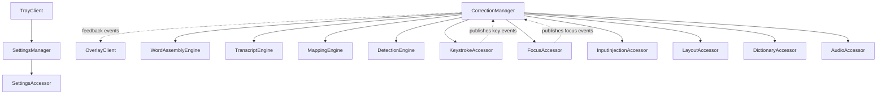
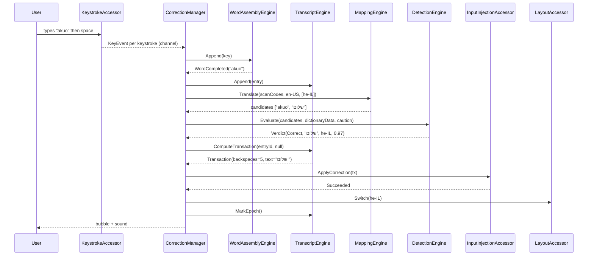
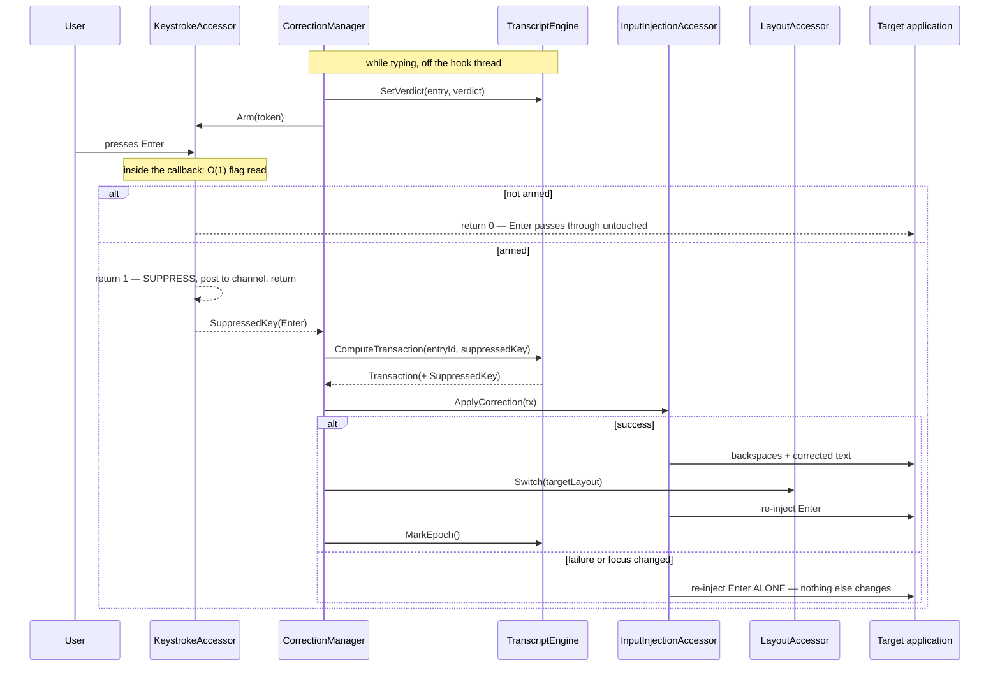
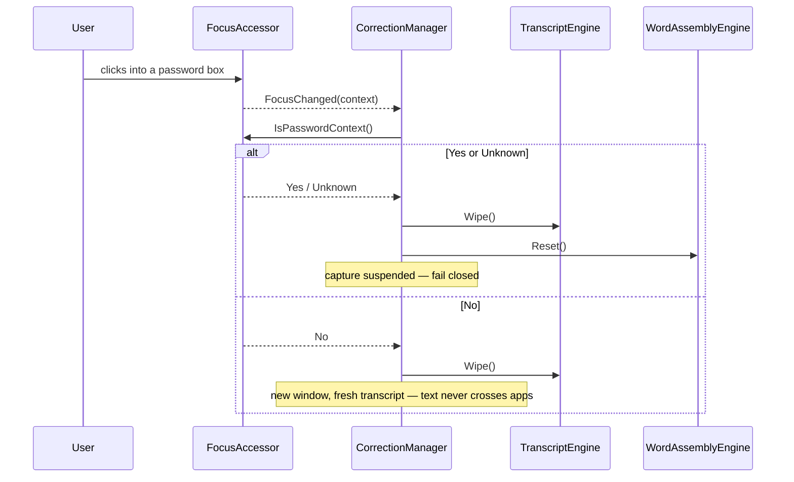

# Review Diagrams: KeyContext AI — Keyboard Layout Auto-Correction

**Feature**: 001-layout-autocorrect
**Phase**: pre-implementation (planning artifact for the reviewer)

These diagrams show what iteration 001 will build, before it exists. The console-ASCII versions are
rendered inline so they are readable in a terminal; the Mermaid versions carry the same content for
hosts that render it.

## Component diagram

```text
  CLIENTS          ┌────────────┐  ┌───────────────┐
                   │ TrayClient │  │ OverlayClient │
                   └─────┬──────┘  └───────▲───────┘
                         │ calls managers  │ feedback events
  MANAGERS         ┌─────▼──────────────┐ ┌┴──────────────────┐
                   │ SettingsManager    │ │ CorrectionManager │◀─┐
                   └─────┬──────────────┘ └┬────────┬─────────┘  │ key/focus
                         │                 │ calls  │ calls      │ events
  ENGINES                │        ┌────────▼──────┐ │            │ (published,
                         │        │ WordAssembly  │ │            │  never called
                         │        │ Transcript    │ │            │  upward)
                         │        │ Mapping       │ │            │
                         │        │ Detection     │ │            │
                         │        └───────┬───────┘ │            │
  ACCESSORS        ┌─────▼─────┐  ┌───────▼─────┐ ┌─▼──────────┐ │
                   │ Settings  │  │ Dictionary  │ │ Keystroke ─┼─┘
                   │ Accessor  │  │ Accessor    │ │ Focus      │
                   └───────────┘  └─────────────┘ │ Injection  │
                                                  │ Layout     │
                                                  │ Audio      │
                                                  └────────────┘
```



The dotted edges are the only upward flow in the system, and they are events, not calls — an accessor
publishes and the manager subscribes. Engines have no outgoing edges at all: `CorrectionManager` hands
them data and receives results.

## Sequence: the canonical correction (word completed by space)



## Sequence: the committing-key path (Option B — the approved design)

This is the sequence that most needs review, because it is the only place the tool withholds a
keystroke from the user's application.



**The property the reviewer should check the implementation against**: every path that leaves the
`armed` branch delivers the Enter to the application. There is no path where a suppressed key is
dropped — that is Phase 2 hardening target 1 and the most important test in iteration 001.

## Sequence: privacy lifecycle



Note that the transcript is wiped on **every** focus change, not only on password focus. That is what
stops text from one application ever influencing a correction in another.
